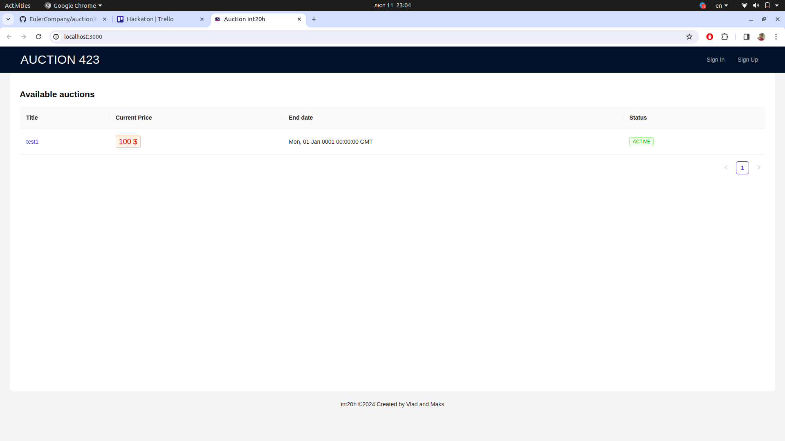
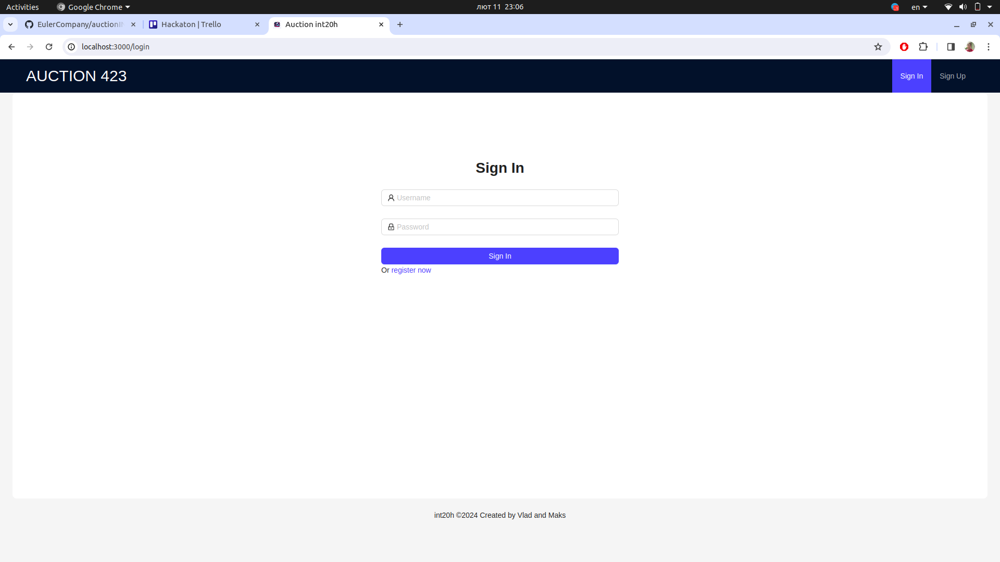
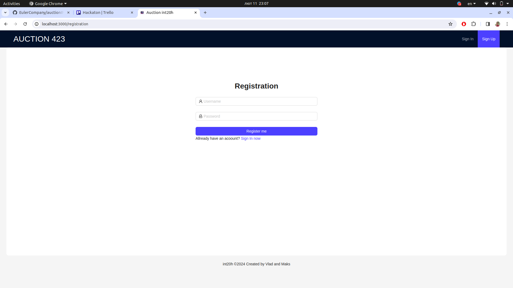
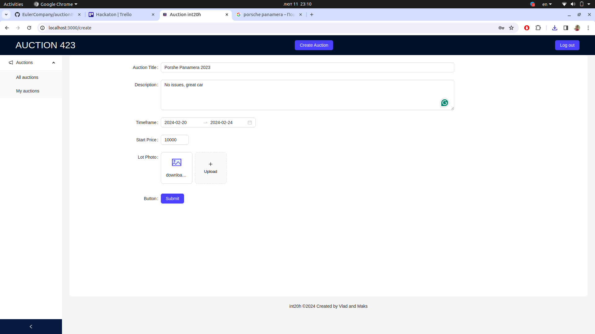
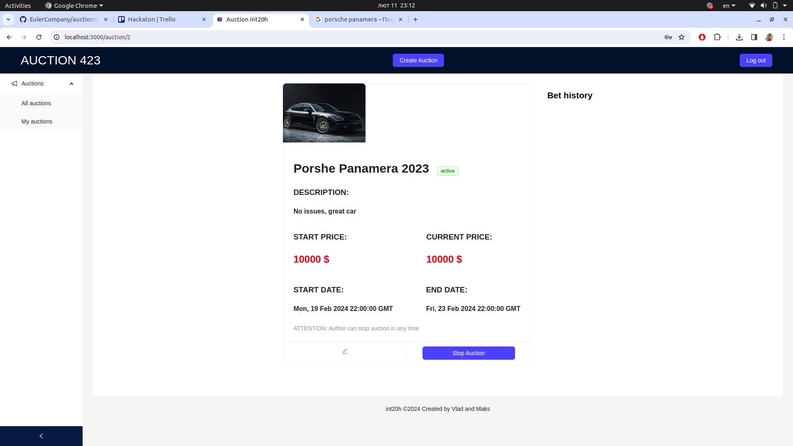
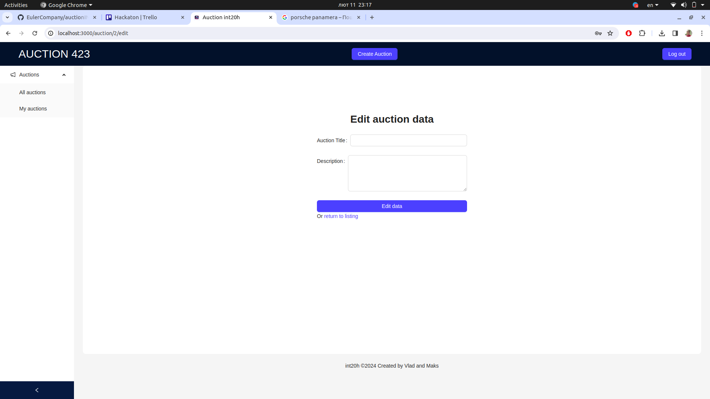
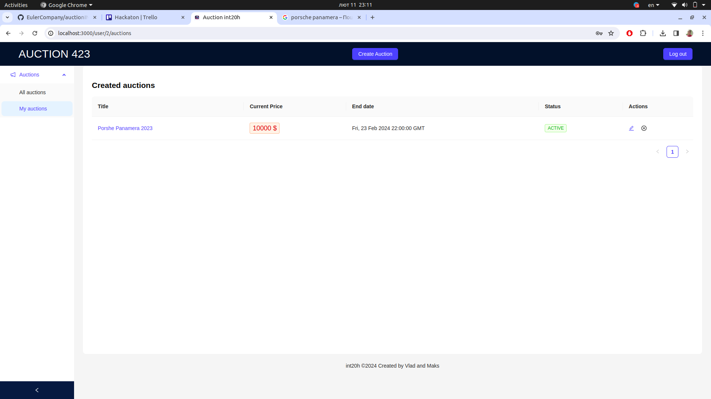

# auctionINT20H
Auction web application made as part of Hackaton INT20H test task

# Requirements
* Go >=1.20
* npm >=9.4.0
* Docker >=24.0.6

# Running
## Backend and Database
To run the backend and the database, `cd` into `backend` directory and run `make compose-up`
This command will spin up two containers with Go service and MySQL.

In database user `root` will be created for the app. The password is the same as login.

Additionally, new Docker volume will be created. To see your volumes run `docker volume ls`

> NOTE: the following setup was used for development and is not recomended for production use

## Frontend 
To run fronted, `cd` into `frontend` directory and run `npm run start`.

> NOTE: this is also will run the application in the debug mode and is not recommended for production use

# Showcase

# Points of Improvement
* Functional Improvements
  * Lazy pagination
    * Currently all the fetches are eager (e.i. all the data being fetched at once)
  * Using Blob Storage for images
  * Externalize parameters and configuration
    * You can pass most of the needed parameters externally, but this is not ogranized in a clear way
    * Additionally the secret key for used for signing tokens not externilized
  * CORS configuration
  * Logging
  * Transactional operations and rollback handling
  * 404
* Code Quality Imporevemtns
  * Better code organization, mainly:
    * Better DTOs
    * Consistent use of repository/service approach
    * Consistent frontend organization (redux slices, decoupled UI components)
* CI/CD Improvements
  * Cloud Deployment
  * Testing
